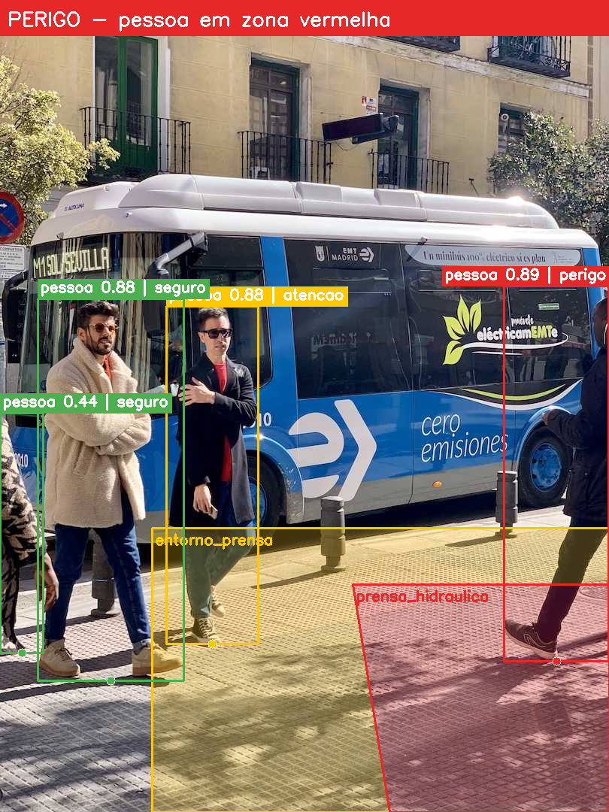
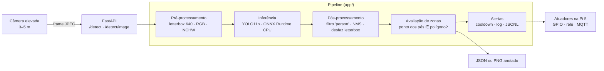

# Monitoramento de Comportamento de Risco em Zonas de Máquinas Pesadas — Edge AI

Sistema de visão computacional embarcada que detecta pessoas em zonas de exclusão ao redor de máquinas pesadas (prensas, injetoras, robôs), classifica o risco em **seguro / atenção (zona amarela) / perigo (zona vermelha)** e dispara respostas proporcionais. Projetado para rodar na **Raspberry Pi 5 (ARM64, somente CPU)**, sem dependência de inferência em nuvem.

> Projeto 3 da Matriz de Projetos — Edge AI / Visão Computacional · Processo seletivo FIT (PNAAT)



*Saída de `POST /detect/image` com a configuração de zonas padrão: a pessoa com os pés na zona vermelha gera **PERIGO**, a da zona amarela gera **ATENÇÃO** e as demais ficam **SEGURAS**.*

---

## Sumário

1. [Arquitetura](#1-arquitetura)
2. [Escolha e justificativa do modelo](#2-escolha-e-justificativa-do-modelo)
3. [Como executar](#3-como-executar)
4. [Endpoints e exemplos](#4-endpoints-e-exemplos)
5. [Configuração das zonas](#5-configuração-das-zonas)
6. [Build multi-arquitetura (amd64/arm64)](#6-build-multi-arquitetura-amd64arm64)
7. [Performance e viabilidade embarcada](#7-performance-e-viabilidade-embarcada)
8. [Adaptações para a Raspberry Pi 5](#8-adaptações-para-a-raspberry-pi-5)
9. [Limitações e próximos passos](#9-limitações-e-próximos-passos)
10. [Estrutura do repositório](#10-estrutura-do-repositório)

---

## 1. Arquitetura



**Regra de risco.** A posição de cada pessoa é o **centro da base da caixa delimitadora** (aproximadamente os pés). Com a câmera no alto, os polígonos são desenhados sobre o piso, então o ponto de apoio representa melhor a posição real da pessoa no chão. Usar o centro da caixa geraria falsos positivos quando o tronco "invade" visualmente a zona sem que a pessoa pise nela. Quando a pessoa está em mais de uma zona, prevalece a mais crítica (vermelha > amarela).

| Nível | Condição | Ação sugerida (`action`) |
|---|---|---|
| `seguro` | Pés fora de qualquer zona | — |
| `atencao` | Pés na zona amarela (entorno) | `alerta_visual_sonoro` (sinaleiro/sirene) |
| `perigo` | Pés na zona vermelha (área da máquina) | `parada_de_emergencia` (relé de parada) |

---

## 2. Escolha e justificativa do modelo

**Modelo escolhido: YOLO11n** (Ultralytics), pré-treinado no COCO e exportado para **ONNX**. Não é necessário fine-tuning: "person" é a classe mais representada do COCO, e o problema exige apenas **detectar pessoas**. A inteligência de domínio (zonas e criticidade) fica na lógica geométrica, que é configurável e auditável.

| Critério | YOLO11n | SSD MobileNetV2 | EfficientDet-Lite0 |
|---|---|---|---|
| mAP COCO (50–95) | ~39,5 | ~22 | ~26 |
| Parâmetros | 2,6 M | ~4,3 M | ~3,2 M |
| Custo (640²) | ~6,5 GFLOPs | menor | similar |
| Exportação ONNX/INT8/NCNN | nativa | via TF | via TFLite |
| Pessoas pequenas/distantes (câmera a 3–5 m) | boa | fraca | razoável |

**Por que ele atende aos requisitos de latência e precisão deste cenário:**

- **Precisão.** Aqui o erro mais caro é o falso negativo, ou seja, não ver uma pessoa na zona vermelha. Com câmera elevada as pessoas aparecem pequenas. O YOLO11n tem quase o dobro do mAP do SSD MobileNet com custo computacional comparável.
- **Latência.** Uma pessoa caminhando a cerca de 1,6 m/s precisa ser detectada em fração de segundo. A variante *nano* é a única da família viável em CPU ARM a vários quadros por segundo. Veja o [orçamento de latência](#orçamento-de-latência) na seção 7.
- **Portabilidade.** O mesmo `.onnx` roda em amd64 e arm64, e a exportação para NCNN, OpenVINO e Hailo parte do mesmo modelo.

**Por que ONNX Runtime e não PyTorch na imagem final?** A imagem de execução não carrega o PyTorch, o que a deixa muito menor. Ela sobe mais rápido na Pi e roda o mesmo artefato em ambas as arquiteturas. A exportação acontece num estágio separado do Dockerfile.

---

## 3. Como executar

### Com Docker (recomendado)

```bash
git clone https://github.com/patrickaraujo/zona-risco-edge-ai.git
cd zona-risco-edge-ai
docker compose up -d --build        # 1º build: ~5–10 min (exporta o modelo)
docker compose logs -f              # aguarde "Modelo carregado"
```

Depois, abra **http://localhost:8000/docs** para usar o Swagger.

Para trocar de modelo sem rebuild (o build gera os três):

```bash
MODEL_FILE=yolo11n_320.onnx docker compose up -d     # mais rápido
MODEL_FILE=yolo11n_int8.onnx docker compose up -d    # pesos INT8
```

### Sem Docker (desenvolvimento)

```bash
python -m venv .venv && source .venv/bin/activate
pip install --index-url https://download.pytorch.org/whl/cpu torch torchvision
pip install -r requirements-dev.txt
python scripts/export_model.py --imgsz 640 320 --int8     # gera models/*.onnx
uvicorn app.main:app --reload
pytest -v
```

### Simulação de câmera em tempo real

```bash
python scripts/stream_client.py --source 0 --fps 5            # webcam → /detect
python scripts/stream_client.py --source video.mp4 --show     # janela com PNG anotado
```

---

## 4. Endpoints e exemplos

| Método | Rota | Descrição |
|---|---|---|
| `POST` | `/detect` | **Inferência → JSON** (pessoas, bbox, confiança, risco, zonas, alertas, métricas) |
| `POST` | `/detect/image` | **Inferência → PNG anotado** (zonas, caixas, rótulos, faixa de status) |
| `GET` | `/health` | Estado do serviço, modelo carregado, arquitetura (`x86_64`/`aarch64`) |
| `GET` / `PUT` | `/zones` | Consulta e redefine as zonas em tempo de execução |
| `GET` | `/events` | Histórico recente de alertas |

### `POST /detect`

```bash
curl -X POST http://localhost:8000/detect -F "file=@samples/bus.jpg"
```

```json
{
  "overall_risk": "perigo",
  "people_count": 4,
  "people": [
    {
      "class_name": "person",
      "confidence": 0.8902,
      "bbox": {"x1": 670.4, "y1": 380.6, "x2": 809.9, "y2": 879.7},
      "anchor_point": [740.2, 879.7],
      "risk": "perigo",
      "zones": ["entorno_prensa", "prensa_hidraulica"]
    },
    {
      "class_name": "person",
      "confidence": 0.8833,
      "bbox": {"x1": 221.7, "y1": 407.4, "x2": 343.8, "y2": 856.2},
      "anchor_point": [282.7, 856.2],
      "risk": "atencao",
      "zones": ["entorno_prensa"]
    }
  ],
  "alerts": [
    {"timestamp": "2026-10-01T13:00:00+00:00", "zone": "prensa_hidraulica",
     "risk": "perigo", "action": "parada_de_emergencia", "people_in_zone": 1, "source": "api"},
    {"timestamp": "2026-10-01T13:00:00+00:00", "zone": "entorno_prensa",
     "risk": "atencao", "action": "alerta_visual_sonoro", "people_in_zone": 2, "source": "api"}
  ],
  "metadata": {
    "model": "yolo11n.onnx", "input_size": [640, 640], "image_size": [810, 1080],
    "preprocess_ms": 7.9, "inference_ms": 147.5, "postprocess_ms": 2.1,
    "total_ms": 158.0, "timestamp": "2026-10-01T13:00:00+00:00"
  }
}
```

*(Resposta abreviada: são 4 pessoas no total.)*

### `POST /detect/image`

```bash
curl -X POST http://localhost:8000/detect/image -F "file=@samples/bus.jpg" \
     -o anotado.png -D -
# Cabeçalhos úteis: X-Overall-Risk: perigo | X-People-Count: 4 | X-Inference-Ms: 147.5
```

**Tratamento de erros:** arquivo vazio → `400`; arquivo que não é imagem → `415`; imagem acima de 10 MB → `413`; modelo não carregado → `503` (a API sobe em modo degradado e o `/health` explica a causa); zonas inválidas → `422`.

**Cooldown de alertas.** Num fluxo contínuo, a mesma pessoa na mesma zona geraria um alerta a cada quadro. Por isso cada par (zona, nível) dispara no máximo uma vez a cada 3 s. O campo `overall_risk` de cada resposta continua refletindo o quadro atual.

---

## 5. Configuração das zonas

As zonas ficam em `config/zones.json`, em **coordenadas normalizadas (0–1)**. A mesma configuração vale para qualquer resolução de câmera.

```json
{
  "zones": [
    {"name": "entorno_prensa",    "level": "amarela",
     "polygon": [[0.25, 0.65], [1.0, 0.65], [1.0, 1.0], [0.25, 1.0]]},
    {"name": "prensa_hidraulica", "level": "vermelha",
     "polygon": [[0.58, 0.72], [1.0, 0.72], [1.0, 1.0], [0.64, 1.0]]}
  ]
}
```

- **Edição sem rebuild:** a pasta `config/` é montada como volume no `docker-compose.yml`.
- **Edição em tempo de execução:** `PUT /zones`, por exemplo quando a câmera é reposicionada. Use `"persist": true` para gravar a alteração no arquivo.

```bash
curl -X PUT http://localhost:8000/zones -H "Content-Type: application/json" -d '{
  "zones": [{"name": "robo_solda", "level": "vermelha",
             "polygon": [[0.4,0.5],[0.9,0.5],[0.9,1.0],[0.4,1.0]]}],
  "persist": false }'
```

---

## 6. Build multi-arquitetura (amd64/arm64)

O Dockerfile tem dois estágios:

1. **`exporter`**, com `--platform=$BUILDPLATFORM`: roda na arquitetura nativa da máquina de build, baixa o `yolo11n.pt` e exporta para ONNX (640, 320 e INT8). Isso é feito **uma única vez**, sem emulação.
2. **`runtime`**: construído para cada plataforma alvo. Usa apenas dependências com wheels oficiais para arm64 (`onnxruntime`, `opencv-python-headless`, `numpy`) e recebe o `.onnx` pronto do estágio anterior.

Essa separação evita rodar o PyTorch sob QEMU, que é a etapa mais lenta e frágil de um build ARM64 emulado.

```bash
./scripts/build_multiarch.sh
# 1) instala os emuladores QEMU (binfmt)
# 2) cria um builder buildx com driver docker-container
# 3) gera linux/amd64 + linux/arm64 → dist/zona-risco-edge-ai-1.0.0-multiarch.tar (OCI)
# 4) carrega a variante arm64 e executa dentro dela: "uname -m = aarch64"

PUSH=1 IMAGE=<usuario>/zona-risco ./scripts/build_multiarch.sh   # publica o manifest list
```

**Comprovação automatizada:** o workflow `.github/workflows/ci.yml` roda os testes, faz o build das duas plataformas a cada push e executa uma inferência real **dentro da imagem arm64** (sob QEMU). O teste confirma `aarch64` e pelo menos 3 pessoas detectadas na imagem de referência.

---

## 7. Performance e viabilidade embarcada

### Benchmark local (CPU, sem GPU)

```bash
python scripts/benchmark.py --threads 4 --runs 50 --out docs/benchmark_x86.json
# ou, dentro do container, limitado a 4 núcleos como a Pi 5:
docker run --rm --cpus=4 zona-risco-edge-ai:1.0.0 python scripts/benchmark.py --threads 4
```

<!-- Substitua pela saída do benchmark na sua máquina -->
| Modelo | Tamanho | Entrada | Threads | Inferência p50 | Total p50 | FPS |
|---|---|---|---|---|---|---|
| yolo11n.onnx (FP32) | — MB | 640 | 4 | — ms | — ms | — |
| yolo11n_320.onnx (FP32) | — MB | 320 | 4 | — ms | — ms | — |
| yolo11n_int8.onnx | — MB | 640 | 4 | — ms | — ms | — |

*Ambiente: [CPU do notebook], Docker com `--cpus=4`.*

Num teste preliminar com **1 thread** de CPU x86 e um modelo YOLO *nano* equivalente a 640×640, a inferência levou cerca de 140 ms (FP32). A versão INT8 levou cerca de 108 ms e ocupou 3,5 MB em vez de 12,8 MB. Houve uma perda: uma pessoa parcialmente cortada na borda da imagem, com confiança 0,44, deixou de ser detectada. **Esse é o tipo de troca que precisa ser avaliada com imagens do ambiente real.**

### Estimativa para a Raspberry Pi 5

- **Referência externa.** A Arm publica um YOLO11n INT8 otimizado (ExecuTorch + XNNPACK) rodando na Pi 5 a **~134 ms p50 (~7,5 FPS)** e mAP 38,9 ([model card](https://huggingface.co/Arm/yolo11n-int8-xnnpack-executorch-raspberrypi5)). A Ultralytics recomenda **NCNN** como o formato mais rápido na Pi ([guia](https://docs.ultralytics.com/guides/raspberry-pi)).
- **Expectativa para este projeto (ONNX Runtime FP32, 640, 4 threads):** algo na faixa de **3–6 FPS**. Com entrada 320 (~4× menos operações), **10+ FPS**. *Essa estimativa ainda precisa ser validada na placa* (ver seção 8).

### Orçamento de latência

A ISO 13855 usa **K = 1,6 m/s** como velocidade de aproximação do corpo humano. A distância mínima entre o limite da zona amarela e o perigo é `S = K × T`, onde **T** é o tempo total de resposta:

| Componente | FP32 640 (~4 FPS) | FP32 320 (~10 FPS) |
|---|---|---|
| Intervalo entre quadros (pior caso) | 250 ms | 100 ms |
| Pipeline (pré + inferência + pós) | 250 ms | 100 ms |
| Confirmação (2 quadros consecutivos) | 250 ms | 100 ms |
| Acionamento (relé/CLP) | 100 ms | 100 ms |
| **T total** | **~850 ms** | **~400 ms** |
| **Faixa amarela mínima (S = 1,6 × T)** | **~1,4 m** | **~0,65 m** |

**Conclusão.** Para **alerta de aproximação**, 3–5 FPS já é aceitável, desde que a faixa amarela tenha largura proporcional à latência. Para **parada de emergência**, o sistema **complementa e não substitui** os dispositivos de segurança certificados exigidos pela NR-12 e pela ISO 13849 (cortinas de luz, scanners a laser, intertravamentos com nível de desempenho validado). O papel dele é monitorar comportamento, registrar ocorrências e reforçar a sinalização.

---

## 8. Adaptações para a Raspberry Pi 5

A implementação e os testes foram feitos em notebook x86_64. Estas são as diferenças esperadas na placa e como tratá-las:

| Aspecto | Notebook (dev) | Raspberry Pi 5 | Adaptação |
|---|---|---|---|
| Arquitetura | x86_64 | ARM64 (Cortex-A76 ×4, 2,4 GHz) | Imagem `linux/arm64` via buildx; apenas wheels com suporte aarch64 |
| Aceleração | CPU (GPU ignorada) | Sem GPU utilizável para inferência | ONNX Runtime CPU, `NUM_THREADS=4`, 1 worker Uvicorn, inferência serializada |
| Otimização | FP32 640 | Recursos limitados | Entrada 320 · pesos INT8 · exportação NCNN, ou quantização estática com imagens do local |
| NPU | — | Opcional: AI Kit / AI HAT+ (Hailo-8L/8) | Compilar o ONNX para `.hef` (Hailo Dataflow Compiler) e mapear `/dev/hailo0` no container |
| Câmera | Webcam / arquivo | Camera Module 3 (CSI) ou câmera IP | `picamera2`/libcamera ou RTSP; `devices: /dev/video*` no compose |
| Térmica | — | Throttling por temperatura sob carga contínua | Active Cooler obrigatório; monitorar `vcgencmd measure_temp` e `get_throttled` |
| Energia | — | Fonte oficial 27 W (5 V/5 A) | Evita subtensão e instabilidade durante picos de inferência |
| Armazenamento | SSD | microSD sujeito a desgaste | Eventos em volume dedicado ou SSD NVMe/USB; logs com rotação (já configurada) |
| Resiliência | — | Operação 24/7 sem operador | `restart: always` + `HEALTHCHECK`; resposta 503 enquanto o modelo não estiver pronto |
| Ambiente físico | — | Vibração, poeira, fumaça | Caixa IP54+, fixação com amortecimento, limpeza periódica da lente |

### Como eu validaria na placa

1. Gravar Raspberry Pi OS 64-bit, instalar o Docker e rodar `uname -m`, que deve retornar `aarch64`.
2. `docker pull` da imagem multi-arch. O Docker escolhe automaticamente a variante arm64.
3. `docker run --rm zona-risco-edge-ai python scripts/benchmark.py --threads 4 --runs 100` para medir FP32 640, FP32 320 e INT8, e comparar com o notebook.
4. **Teste de estabilidade térmica:** 30 min de `stream_client.py` a 5 FPS, registrando a temperatura e o estado de throttling. A latência p95 não deve se degradar.
5. **Teste funcional em campo:** gravar vídeo com a câmera instalada a 3–5 m, rotular manualmente as entradas nas zonas e medir recall de pessoas na zona vermelha (a meta é ≥ 95%) e falsos alarmes por hora.
6. Ajustar `CONF_THRESHOLD`, o tamanho de entrada e a largura da faixa amarela com base nos passos 3 a 5.

---

## 9. Limitações e próximos passos

- **Temporalidade.** Cada quadro é avaliado isoladamente. O próximo passo é adicionar rastreamento (ByteTrack) para contar tempo de permanência na zona e exigir N quadros consecutivos antes do alerta de perigo.
- **"Comportamento" além de presença.** Um modelo de pose (YOLO11n-pose) permitiria detectar pessoa agachada ou braço estendido em direção à máquina.
- **Oclusão e distância.** Pessoas muito pequenas ou parcialmente ocultas reduzem a confiança. Uma câmera mais próxima ou em ângulo mais vertical ajuda, assim como fine-tuning com imagens do próprio galpão.
- **Integração.** Publicar eventos via **MQTT** para o supervisório e acionar sinaleiro via **GPIO** (`gpiozero`), plugando handlers no `AlertDispatcher` sem alterar o pipeline.
- **Privacidade (LGPD).** O sistema não armazena imagens por padrão, apenas eventos. Se necessário, é possível aplicar desfoque de rosto nas imagens de evidência.

---

## 10. Estrutura do repositório

```
├── app/
│   ├── main.py          # API FastAPI (endpoints, validação de upload, erros)
│   ├── detector.py      # pré-processamento · inferência ONNX · pós-processamento (NMS)
│   ├── zones.py         # polígonos, ponto de apoio, classificação de risco
│   ├── alerts.py        # eventos, cooldown, handlers (GPIO/MQTT plugáveis)
│   ├── annotate.py      # desenho das zonas, caixas e status
│   ├── schemas.py       # modelos Pydantic (documentação Swagger)
│   └── config.py        # configuração via variáveis de ambiente
├── config/zones.json    # zonas de risco (coordenadas normalizadas)
├── scripts/
│   ├── export_model.py      # YOLO11n → ONNX (640, 320, INT8)
│   ├── benchmark.py         # latência por etapa, p50/p95, FPS
│   ├── build_multiarch.sh   # buildx amd64 + arm64 + validação arm64
│   └── stream_client.py     # simulação de câmera em tempo real
├── tests/               # unitários (zonas, API com detector falso) + integração (modelo real)
├── samples/             # imagens de teste
├── docs/                # imagens e resultados de benchmark
├── Dockerfile           # multi-stage: exporter ($BUILDPLATFORM) → runtime
├── docker-compose.yml   # restart: always, limites de CPU/memória, volumes
└── .github/workflows/ci.yml  # testes + build multi-arquitetura + smoke test arm64
```

---

## Licenças e créditos

- Os pesos do **YOLO11** (Ultralytics) são distribuídos sob **AGPL-3.0**. Uso comercial em produto fechado exige a licença Enterprise da Ultralytics.
- As imagens em `samples/` são as imagens de exemplo do repositório Ultralytics.
- Autor: **Patrick Anderson Matias de Araújo** — [github.com/patrickaraujo](https://github.com/patrickaraujo)
